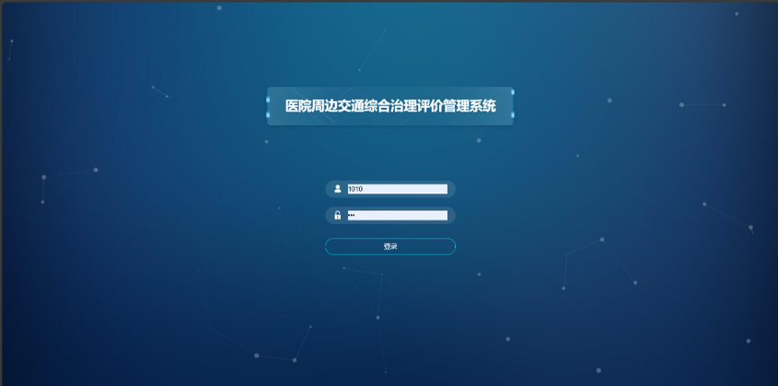
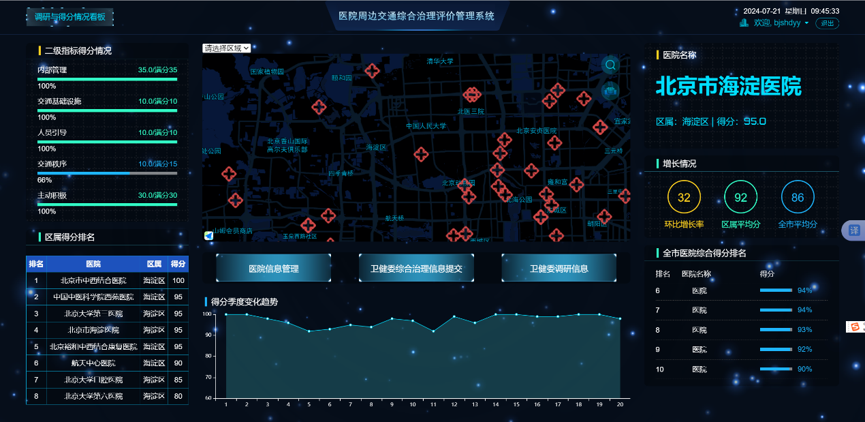
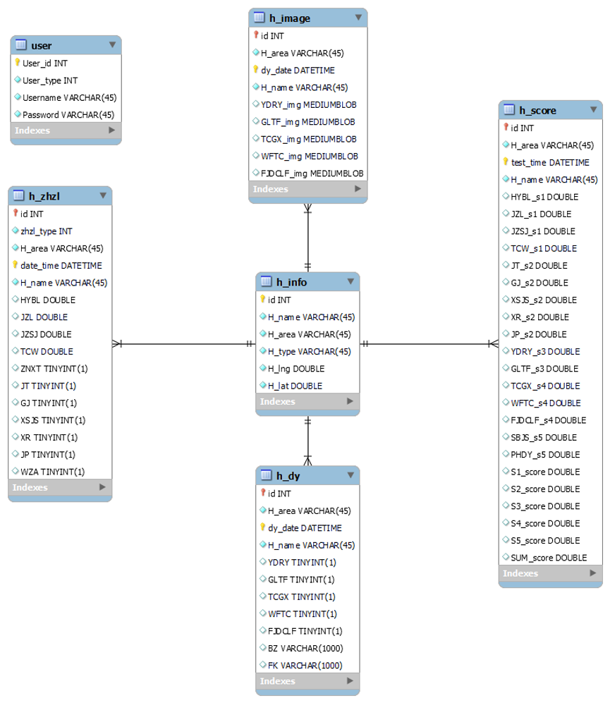

# Urban Medical Traffic Governance Dashboard

一个面向医院周边交通治理场景的多角色数据采集、评分分析与可视化决策平台。本仓库提供的是脱敏后的展示版本，基于 Django + MySQL 构建，围绕“医院基础信息管理—现场调研采集—综合治理填报—评分分析—大屏可视化”形成一个治理数据闭环。

> 数据说明：仓库中的演示数据为虚假脱敏样例。项目保留北京区县、医院等级和近似坐标等业务语境，但医院名称、账号、调研内容和图片均使用示例或脱敏数据。

> 页面来源说明：本项目中部分 dashboard 页面布局与图表样式设计修改自 [iGaoWei/BigDataView](https://github.com/iGaoWei/BigDataView)，并结合医院周边交通治理业务进行了二次开发和数据接入改造。

## 项目背景

医院周边通常存在就诊高峰拥堵、停车资源紧张、非机动车乱停放、行人过街安全、救护通道保障等复合治理问题，本项目将医院基础信息、现场调研记录、综合治理填报、评分指标和可视化大屏整合到同一系统中。

系统目标包括：

- 支持不同角色参与医院周边交通治理数据管理。
- 沉淀医院基础信息、调研记录、治理填报和评分结果。
- 通过地图、排名、指标图表和趋势分析辅助治理评估。

## 部分界面（非真实数据）



## 当前状态

部分功能在改造中 🚧。

| 模块 | 状态 | 说明 |
| --- | --- | --- |
| 医院信息管理 | 已完成 | 支持查询、新增、编辑和软停用。 |
| 调研信息提交 | 已完成 | 支持按区属选择医院，提交治理项、备注和图片。 |
| 综合治理填报 | 已完成 | 支持录入内部管理、交通设施、人员引导、交通秩序相关字段。 |
| 大屏可视化 | 已完成 | 已接入后端脱敏数据，但部分图表和排名仍需继续动态化和细化。 |
| 角色权限细化 | 施工中 🚧 | 已有基础角色限制，后续会补充更细粒度页面/数据权限。 |
| 评分规则配置化 | 施工中 🚧 | 当前已有评分记录展示，后续会补充指标权重、自动计算和规则说明。 |
| 舆情与 AI 分析 | 施工中 🚧 | 计划加入 BERT 情感分类和 LDA 主题建模，但当前尚未实现。 |

## 功能模块

### 1. 多角色管理

系统基于 Django Auth 实现登录认证，并通过 `UserProfile` 扩展用户角色。

- 管理员：可访问大屏、医院管理、调研数据提交、综合治理填报等核心功能。
- 调研员：可访问调研表单，提交医院周边现场治理情况。
- 医院用户：可访问与本医院相关的大屏展示数据。

### 2. 医院基础信息管理

管理员可维护医院基础信息，包括：

- 医院名称
- 所属区县
- 医院等级/类型
- 经纬度
- 是否启用

### 3. 现场调研采集

调研员或管理员可按区属选择医院，并提交现场调研信息：

- 是否有工作人员引导机动车入院
- 是否有工作人员管理非机动车停放
- 是否与周边停车资源共享
- 出入口附近是否存在机动车违法停车
- 出入口附近是否存在非机动车乱停乱放
- 备注说明
- 调研图片上传

上传图片保存到 `media/survey/`，数据库中保存图片路径。

### 4. 综合治理填报

综合治理表单用于记录医院及周边治理措施，包括：

- 上下午门诊号源比例
- 预约就诊率
- 精准就诊时间
- 停车位开放比例
- 智能治理系统建设
- 禁停标志标线
- 行人过街设施
- 限速/减速标识
- 注意行人标志
- 非现场执法监拍设施
- 无障碍设施

### 5. 评分分析与可视化大屏

系统通过评分记录展示医院综合治理表现，包括：

- 医院综合得分
- 一级/二级指标得分
- 区域排名
- 医院排名
- 地图点位展示
- 趋势图与图表看板

当前大屏已经接入后端 JSON 数据，但仍有部分展示项处于施工中 🚧。

## 技术栈

- Backend：Python, Django
- Database：MySQL 8.0, Docker Compose
- Frontend：Django Templates, jQuery, ECharts, AMap Web JS API
- Auth：Django Auth + `UserProfile`
- Assets：Django static/media
- Deployment：`.env` configuration + Docker Compose

## 系统架构


```text
Browser
  |
  | HTTP requests / form submissions / AJAX requests
  v
Django Application
  |
  |-- Templates Rendering
  |-- JSON Endpoints
  |-- Auth & Role Control
  |     |-- Admin
  |     |-- Surveyor
  |     |-- Hospital User
  |
  |-- Business Modules
  |     |-- Hospital Information Management
  |     |-- Survey Data Collection
  |     |-- Governance Form Submission
  |     |-- Score Analysis
  |     |-- Dashboard Data Aggregation
  |
  |-- Data Services
  |     |-- ORM Models
  |     |-- Query & Filtering
  |     |-- Demo Data Seeding
  |     |-- File Upload Handling
  |
  v
MySQL 8.0
  |
  |-- Hospital Base Data
  |-- Survey Records
  |-- Governance Records
  |-- Score Records
  |-- User Role Profiles
  |-- Uploaded Image Paths

Media Storage
  |
  |-- Uploaded survey images

Environment & Deployment
  |
  |-- Docker Compose for MySQL
  |-- .env configuration
  |-- AMap Web Key injection
```

## 数据设计与流程



```text
Hospital / Surveyor / Admin Input
  |
  | Submit hospital information, survey records, governance forms, and images
  v
Django Form & Permission Validation
  |
  | Validate role, hospital binding, required fields, and uploaded files
  v
MySQL Persistence
  |
  | Store hospital profiles, survey records, governance records, scores, and image paths
  v
Aggregation & Query Layer
  |
  | Generate district-level rankings, hospital scores, indicator statistics, and trend data
  v
Dashboard Visualization
  |
  | Render hospital map, score ranking, indicator comparison, and trend charts
```

## 核心数据模型


- `HInfo`：医院基础信息，包括名称、区属、类型、经纬度和启用状态。
- `UserProfile`：用户角色扩展，关联 Django Auth 用户与医院。
- `HScore`：医院评分记录，包括一级指标、二级指标和综合得分。
- `HDy`：现场调研记录，保存交通秩序与人员引导相关观察项。
- `HImage`：调研图片记录，保存图片类别和文件路径。
- `HZhzl`：综合治理填报记录，保存治理措施和管理指标。

## Planned AI-assisted Module：公众反馈与舆情分析 🚧

该模块改进中，增加轻量级 NLP 分析能力，分析医院周边交通相关的投诉、调研备注、公众反馈和类社交媒体文本。

```text
Public Feedback Text
  |
  | Text Cleaning / Tokenization
  v
NLP Analysis Module
  |
  |-- BERT Sentiment Classification
  |-- LDA Topic Modeling
  v
Opinion Analytics APIs
  |
  |-- Sentiment Distribution
  |-- Topic Keywords
  |-- District Risk Ranking
  v
Dashboard Visualization
```

具体功能包括：

- 公众反馈文本数据表。
- BERT/RoBERTa 中文情感分类。
- LDA 主题建模与关键词提取。
- 区域负面反馈占比统计。
- 高频问题主题分析。
- 舆情风险排行与可视化展示。

## 本地部署

### 1. 准备环境

```bash
cp .env.example .env
python3 -m venv .venv
source .venv/bin/activate
pip install -r requirements.txt
```

### 2. 启动 MySQL

```bash
docker compose up -d db
```

### 3. 初始化数据库

```bash
python manage.py migrate
python manage.py seed_demo
```

### 4. 启动服务

```bash
python manage.py runserver
```

访问地址：

```text
http://127.0.0.1:8000/
```


## Demo 账号

| 角色 | 用户名 | 密码 |
| --- | --- | --- |
| 管理员 | `demo_admin` | `DemoAdmin123!` |
| 调研员 | `demo_surveyor` | `DemoSurvey123!` |
| 医院用户 | `demo_hospital` | `DemoHospital123!` |

## 常用命令

```bash
python manage.py check
python manage.py test
python manage.py seed_demo
docker compose down
```

## 后续开发计划

- 补充评分规则配置化、指标权重和自动评分逻辑。
- 完善管理员、调研员、医院用户之间的数据权限边界。
- 增加 REST-style JSON API 与接口文档。
- 施工中 🚧：修改公众反馈与风险舆情分析模块，加入 LDA 主题建模和 BERT 情感分类。
